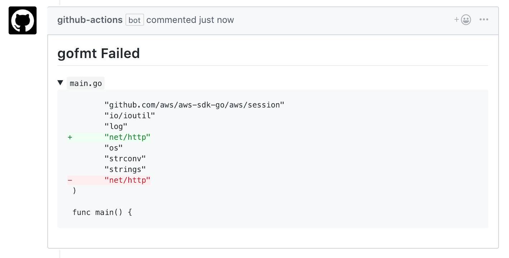
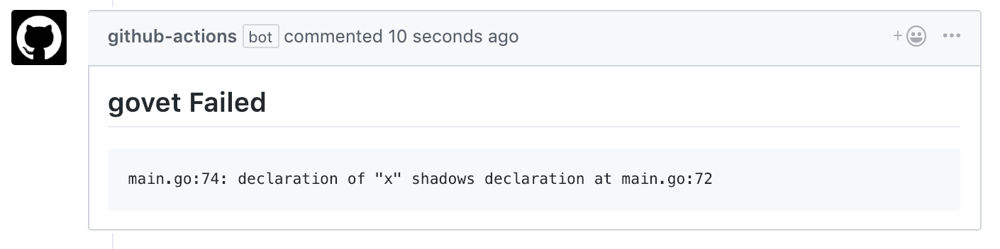
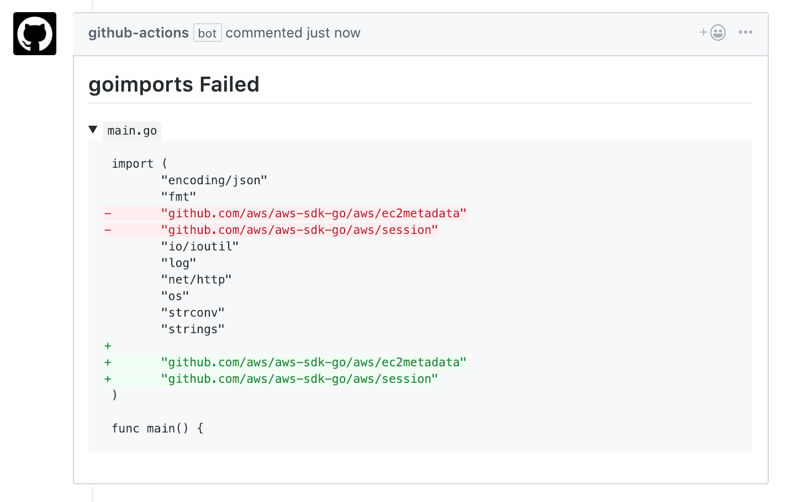
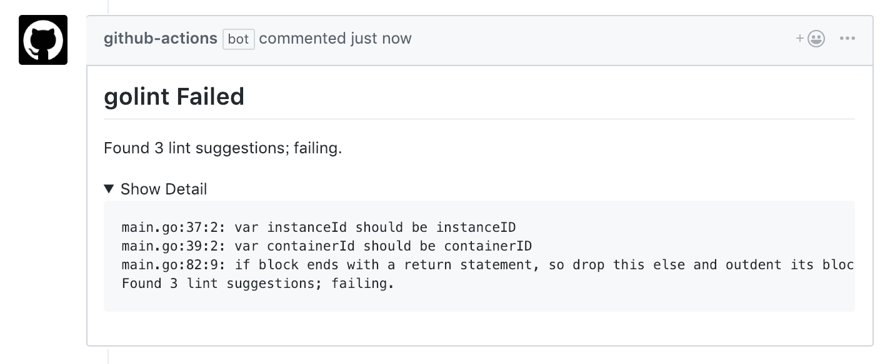
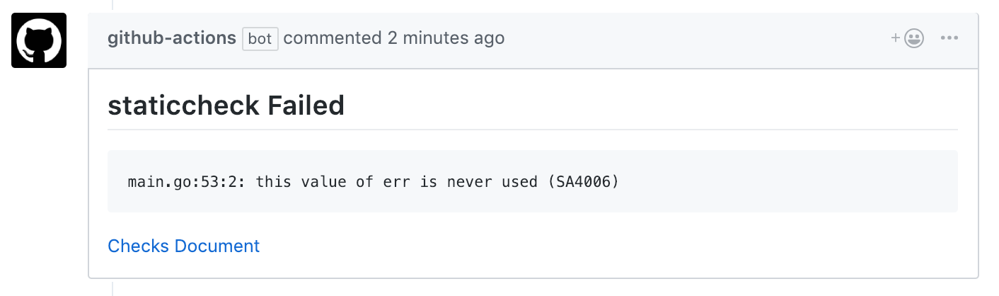
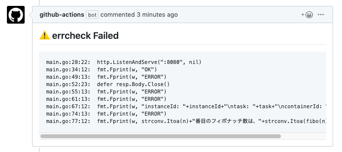
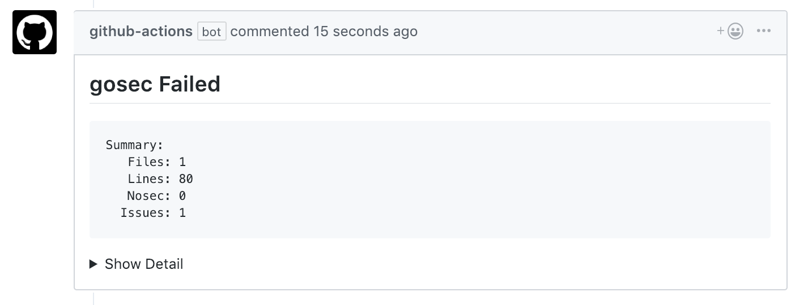

# Golang GitHub Actions

## Actions

### Fmt Action
Runs `gofmt` and comments back on error.


### Vet Action
Runs `go vet` and comments back on error.


### Shadow Action
Runs `go vet --vettool=/go/bin/shadow` and comments back on error.  
Use [golang.org/x/tools/go/analysis/passes/shadow/cmd/shadow](https://godoc.org/golang.org/x/tools/go/analysis/passes/shadow/cmd/shadow)

### Imports Action
Runs `goimports` and comments back on error.  
Use [golang.org/x/tools/cmd/goimports](https://godoc.org/golang.org/x/tools/cmd/goimports)


### Lint Action
Runs `golint` and comments back on error.  
Use [golang.org/x/lint/golint](https://github.com/golang/lint)


### Staticcheck Action
Runs `staticcheck` and comments back on error.  
Use [honnef.co/go/tools/cmd/staticcheck](https://staticcheck.io/)


### Errcheck Action
Runs `errcheck` and comments back on error.  
Use [github.com/kisielk/errcheck](https://github.com/kisielk/errcheck)


### Sec Action
Runs `gosec` and comments back on error.  
Use [github.com/securego/gosec/cmd/gosec](https://github.com/securego/gosec)


## Sample Workflow

`.github/main.workflow`

```hcl
workflow "Golang Test Workflow" {
  on = "pull_request"
  resolves = [
    "go imports",
    "go vet",
    "staticcheck",
    "errcheck",
    "go sec",
  ]
}

action "filter to pr open synced" {
  uses = "actions/bin/filter@master"
  args = "action 'opened|synchronize'"
}

action "go imports" {
  uses = "grandcolline/golang-github-actions/imports@v0.2.0"
  needs = "filter to pr open synced"
  secrets = ["GITHUB_TOKEN"]
}

action "go lint" {
  uses = "grandcolline/golang-github-actions/lint@v0.2.0"
  needs = "filter to pr open synced"
  secrets = ["GITHUB_TOKEN"]
}

action "go vet" {
  uses = "grandcolline/golang-github-actions/vet@v0.2.0"
  needs = "filter to pr open synced"
  secrets = ["GITHUB_TOKEN"]
}

action "shadow" {
  uses = "grandcolline/golang-github-actions/shadow@v0.2.0"
  needs = "filter to pr open synced"
  secrets = ["GITHUB_TOKEN"]
}

action "staticcheck" {
  uses = "grandcolline/golang-github-actions/staticcheck@v0.2.0"
  needs = "filter to pr open synced"
  secrets = ["GITHUB_TOKEN"]
}

action "errcheck" {
  uses = "grandcolline/golang-github-actions/errcheck@v0.2.0"
  needs = "filter to pr open synced"
  secrets = ["GITHUB_TOKEN"]
  env = {
    IGNORE_DEFER = "true"
  }
}

action "go sec" {
  uses = "grandcolline/golang-github-actions/sec@v0.2.0"
  needs = "filter to pr open synced"
  secrets = ["GITHUB_TOKEN"]
  env = {
    FLAGS = "-exclude=G104"
  }
}

```
